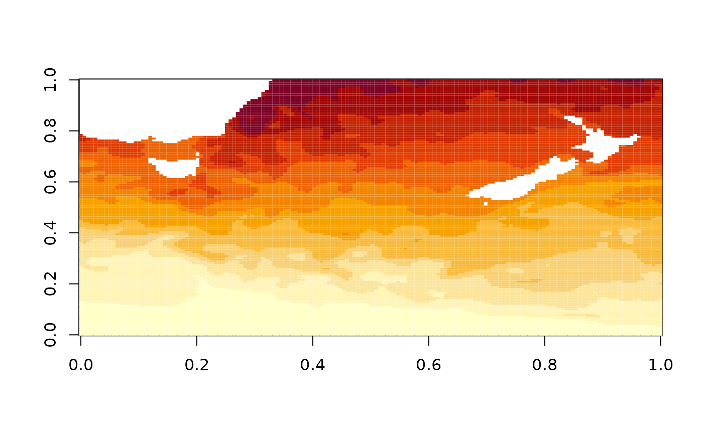
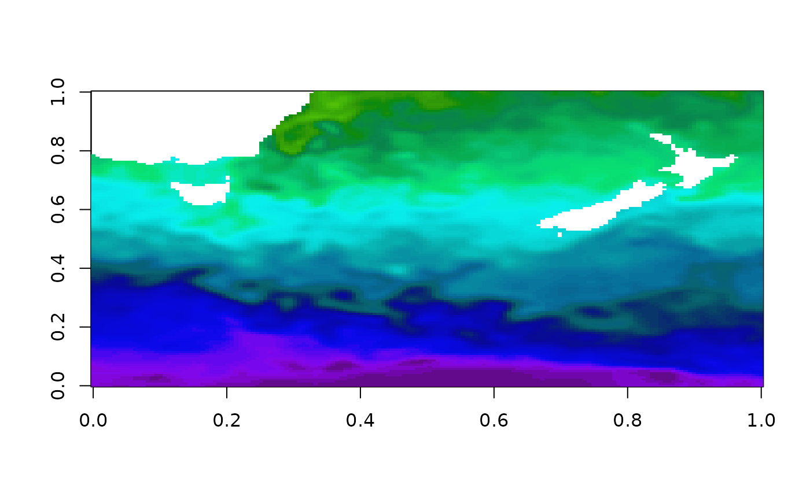
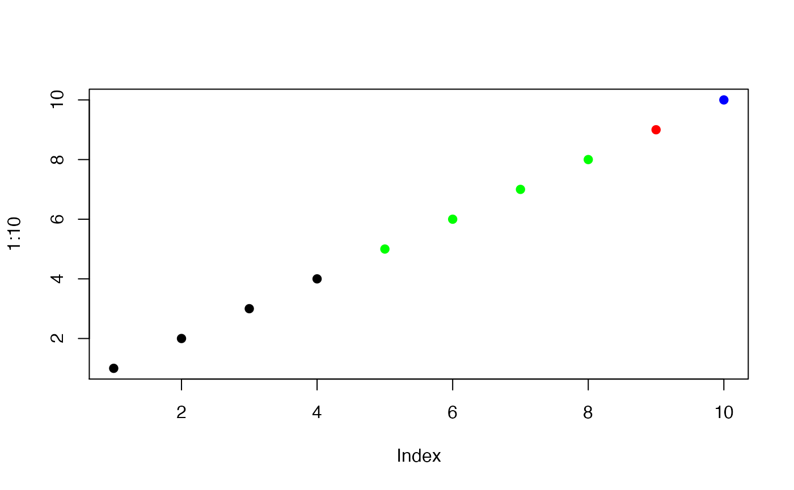
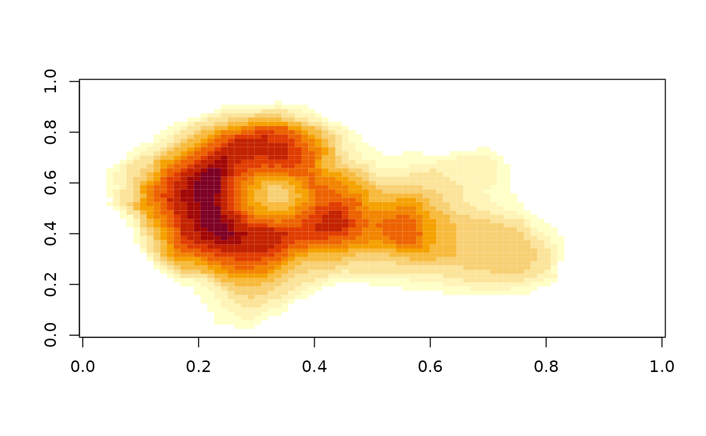
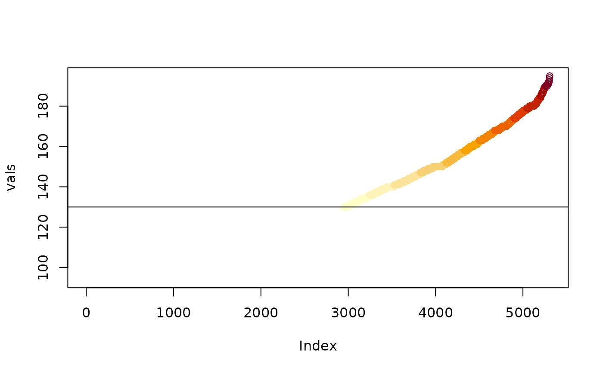

# Colour palettes

## palr

Colours can be frustrating to get just right in R. The palr package
provides simple palette functions with standard colour schemes matched
to real data values.

There are three main ways of working with palr palette functions.

- `pal(n)` return n colours from the palette
- `pal(data)` return the right colour for values in `data`
- `pal(palette = TRUE)` return the entire palette, with colours `cols`
  and intervals `breaks`

### Examples

Here we show examples of the use of palr functions.

The `oisst` data set is a subset the NOAA 1/4° daily Optimum
Interpolation Sea Surface Temperature (Reynolds, 2007) obtained from the
National Oceanic and Atmospheric Administration (NOAA).

``` r

library(palr)
data(oisst)
image(oisst)
```



The default plot colours uses a setting provided by the base package,
but we have SST data in degrees Celsius so we can use the `sst_pal`
function to give specific colours for particular temperatures. The full
range of the temperatures is shown on the plot legend, even though our
data only has values in the range NA, NA.

``` r

sstcols <- sst_pal(palette = TRUE)
image(oisst, col = sstcols$col, zlim = range(sstcols$breaks))
```



Because we have the palette colours and data in an absolute palette we
can also plot other data correctly to scale.

### Bake those colours

The function
[`image_pal()`](https://australianantarcticdivision.github.io/palr/reference/image_pal.md)
can be used to *bake* a particular colour scheme into data. This is a
bit like the colourvalues package function `colour_values()`, which
takes raw values and maps them to a colour scale but is modelled on the
[`image()`](https://rdrr.io/r/graphics/image.html) function. The image
function takes a set of colours and a set of
`breaks to define the colour scale, and`image_pal()\` mirrors its
defaults.

``` r

(col <- image_pal(1:10, breaks = c(0, 4, 8, 9, 10), col = c("black", "green", "red", "blue")))
```

    ##  [1] "#000000" "#000000" "#000000" "#000000" "#00FF00" "#00FF00" "#00FF00"
    ##  [8] "#00FF00" "#FF0000" "#0000FF"

``` r

plot(1:10, col = col, pch = 19)
```



By using breaks we are able to control the actual scale of the colour
mapping, we can provide different data values but still get the same
colour for the same value input (if we set up the scale based on the
original data we might have the wrong range).

There’s a simpler interface for using absolute colours than specifying
every break, by using `zlim`. This value is ignored if `breaks` is set.

``` r

image(volcano, zlim = c(130, max(volcano)))
```



``` r

vals <- sort(unique(volcano))
cols <- image_pal(vals, zlim = c(130, max(volcano)))
plot(vals, col = cols); abline(h = 130)
```



There are analogous worker functions
[`image_raster()`](https://australianantarcticdivision.github.io/palr/reference/image_pal.md)
and
[`image_stars()`](https://australianantarcticdivision.github.io/palr/reference/image_pal.md)
for packages raster and stars, so we can emulate a given plot effect and
save it as a data object, this can be easily written out to image format
such at GeoTIFF or PNG.

### References

Reynolds, R. W., T. M. Smith, C. Liu, D. B. Chelton, K. S. Casey, and M.
G. Schlax, 2007: Daily high-resolution-blended analyses for sea surface
temperature. Journal of Climate, 20, 5473–5496.
